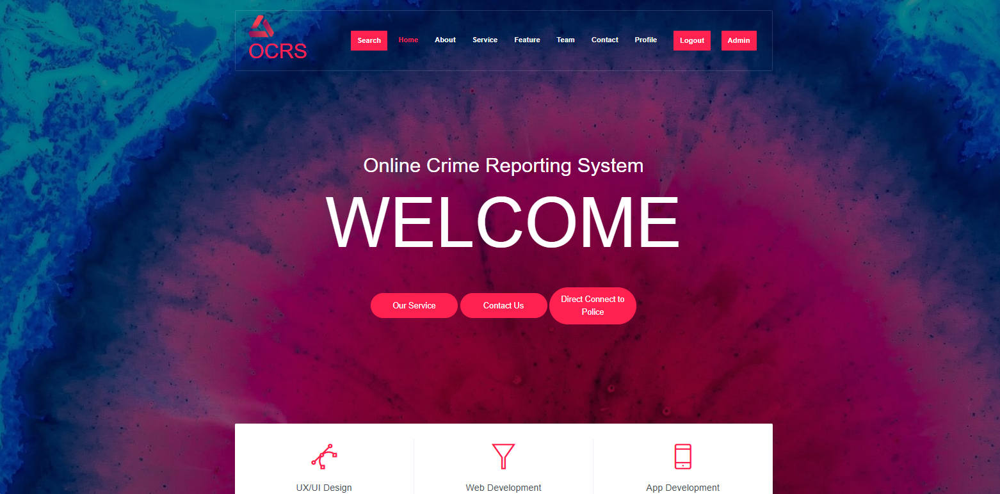
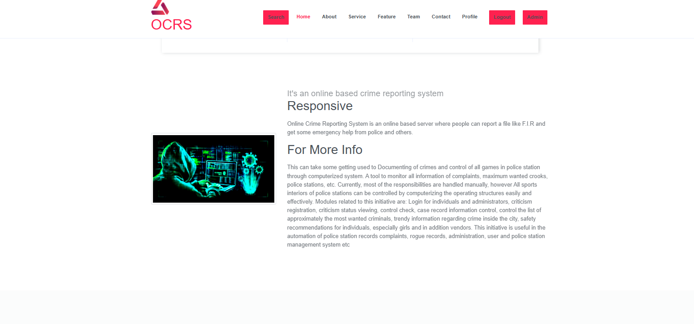
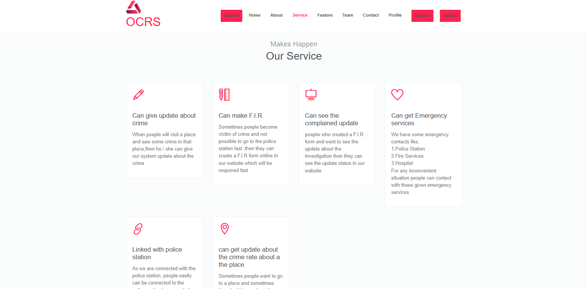
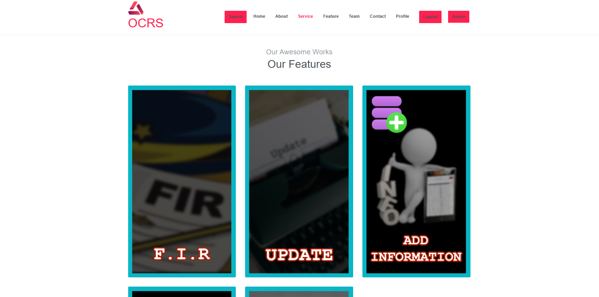

# OCRS - Online Crime Reporting Server
> A secure and user-friendly web application for reporting crimes online, tracking case status, and facilitating communication between the public and law enforcement agencies.

---
## About the Project

**OCRS** (Online Crime Reporting Server) is a web-based platform that empowers citizens to:
- Report crimes without visiting police stations.
- Track the status of their complaints.
- Communicate securely with law enforcement officers.
- Can get update about the crime rate about a the place

It aims to digitize the crime reporting process, reduce paperwork, and make justice more accessible and transparent.

## Features

- 📝 F.I.R - Online crime/incident report submission.
- 🔍 Information - Case tracking by complaint ID.
- 👮  Update - Admin dashboard for managing complaints.
- 📬 Emergency Contact - Secure communication with police officers.
- 🔐 Sign up - Role-based access: Public, Admin, Officer.
- 📊 Crime Record - Complaint statistics and reporting.

## Screenshots

#### Home Page

#### About Page

#### Service Page

#### Feature Page

#### Contact

---
## Tech Stack

| Layer        | Technology                   |
|--------------|-------------------------------|
| Frontend     | HTML, CSS, Bootstrap          |
| Backend      | Python    |
| Database     | MySQL                         |
| Server       | Apache / Localhost (XAMPP)    |
| Version Ctrl | Git, GitHub                   |

> ⚙️ Built as part of a university web systems project.

---
